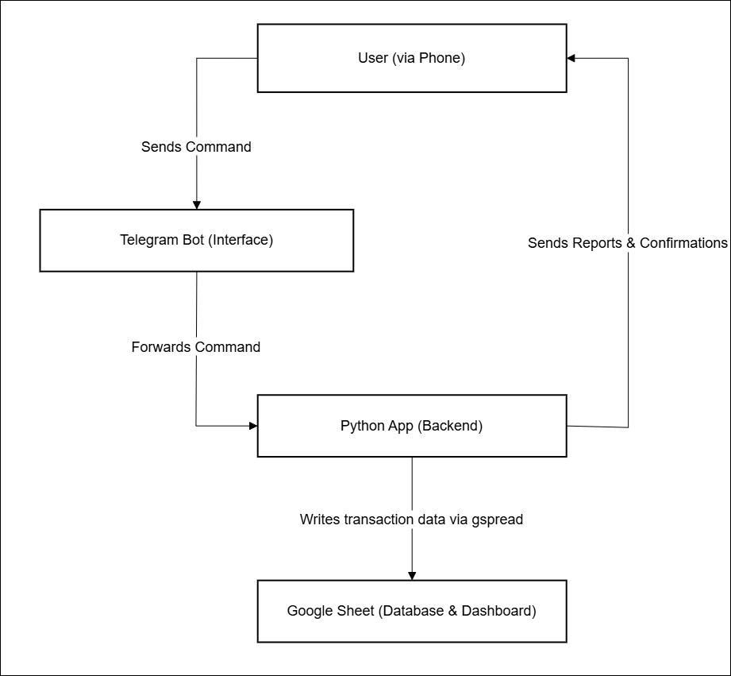
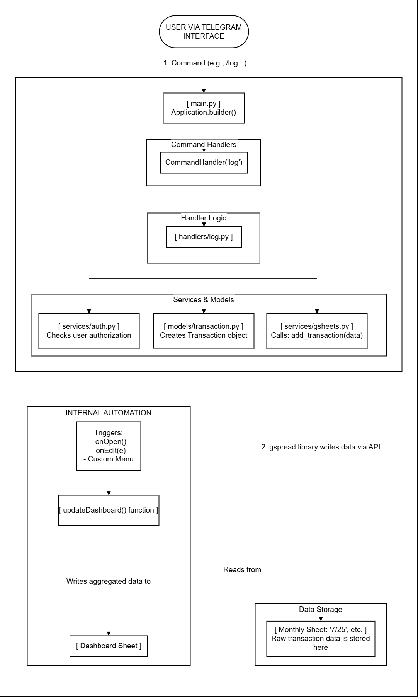

# Architecture Overview

This document outlines the architecture of a Telegram-based financial management application that integrates with Google Sheets for data storage and visualization. The architecture is presented in two models: a high-level overview and a detailed component breakdown.

## **Model 1: High-Level Overview**

This model provides a simplified, user-centric view of the system's data flow, focusing on the main actors and their interactions from command to confirmation.

**Workflow Description:**

The system's flow at this level is very linear and focuses on user interaction:

1.  **User Sends Command**: The user interacts with the system by sending a command through the Telegram Bot interface, such as `/catat` to log a transaction or `/laporan` to request a financial summary.
2.  **Bot Forwards Command**: The Telegram infrastructure receives this command and forwards it to the running Python backend application.
3.  **Backend Processes and Writes Data**: The Python application processes the command. If it's a logging command, the backend formats the transaction data and uses the `gspread` library to write it to the Google Sheet, which acts as the database.
4.  **Backend Sends Response**: After processing the command, the Python application sends a confirmation message (e.g., "Successfully logged") or the requested report back to the user via the Telegram API.

## **Model 2: Component and Responsibility Canvas**

This model provides a more in-depth, technical view, breaking down each major part into its components and responsibilities. It illustrates how requests are handled internally by the Python application and how automation in Google Sheets works.

| **User**                                                                   | **Telegram Infrastructure**                                                                                                   | **Python Application (Backend)**                                                                                                                                                            | **Google Sheets (Database & Frontend)**                                                                                                                                                         |
| :------------------------------------------------------------------------- | :---------------------------------------------------------------------------------------------------------------------------- | :------------------------------------------------------------------------------------------------------------------------------------------------------------------------------------------ | :---------------------------------------------------------------------------------------------------------------------------------------------------------------------------------------------- |
| **Actor:**   - Finance Owner                                            | **Platform:**   - Telegram Bot API                                                                                         | **Core Components:**   - `main.py` (Entry Point)   - `handlers/` (Command Logic)   - `services/` (Business Logic)   - `models/` (Data Structure)                                | **Core Components:**   - `Dashboard` Sheet   - Monthly Sheets (`6/25`, `7/25`, etc.)   - Google Apps Script (Automation)                                                               |
| **Actions:**   - Send `/start`   - Send `/log`   - Send `/report` | **Tasks:**   - Receive messages from user   - Forward to Python webhook/polling   - Send replies from Python to user | **Tasks:**   - Authenticate user   - Validate command format   - Process data (create `Transaction` object)   - Contact Google Sheets API   - Format and send report replies | **Tasks:**   - Store raw transaction data   - Act as a data source for the dashboard   - Execute `onEdit` and `onOpen` scripts   - Display data visualizations (tables & summaries) |
| **Output:**   - Confirmation messages   - Financial reports          | **Connection:**   - `TELEGRAM_BOT_TOKEN`                                                                                   | **Connection:**   - `credentials.json`   - `gspread` library                                                                                                                          | **Connection:**   - Editor Access for Service Account                                                                                                                                        |

---

 

### Technical Workflow Description:

**Python Application (Backend):**

-   **Command Handling**: The application's entry point is `main.py`, which initializes the `Application` from `python-telegram-bot`. This file registers command handlers (e.g., `CommandHandler("catat", catat)`) that map Telegram commands to specific functions within the `handlers/` directory.
-   **Handler Logic**: Each handler function (e.g., `catat` or `laporan`) is responsible for the command's business logic. The process includes:
    1.  **Authentication**: Verifying if the sender's `user_id` is authorized to use the bot by calling `auth_service.user_is_allowed()`.
    2.  **Data Modeling**: For data logging, a `Transaction` object is created to structure the data, such as date, category, and amount.
    3.  **Service Interaction**: The handler calls the `GoogleSheetsService` (`sheets_service`) to interact with the Google Sheet. For instance, `sheets_service.add_transaction()` is called to add new data.
-   **Google Sheets Service**: The `GoogleSheetsService` abstracts all logic for connecting to Google Sheets. It can create new monthly sheets (e.g., `6/25`) if they don't exist and append new transaction rows to them. It can also programmatically trigger a dashboard update.

**Google Sheets (Database & Internal Automation):**

-   **Data Storage**: Raw transactions are stored in separate monthly sheets named in `M/YY` format (e.g., `6/25`). Each row represents a single transaction with columns for Date, Category, Income, and Expense.
-   **Dashboard Automation**: There is a main sheet named `Dashboard` that displays aggregated data and visualizations. The calculations on this dashboard (e.g., monthly totals, top expenses) are fully automated using Google Apps Script.
-   **Triggers**: This script is executed automatically by triggers like `onOpen` (when the spreadsheet is opened) and `onEdit` (when a value is changed, like updating the year in cell `C1`). This ensures the dashboard always shows the latest data without manual intervention. Additionally, the Python bot also triggers an update after each new transaction is added, ensuring the data is always in sync.
