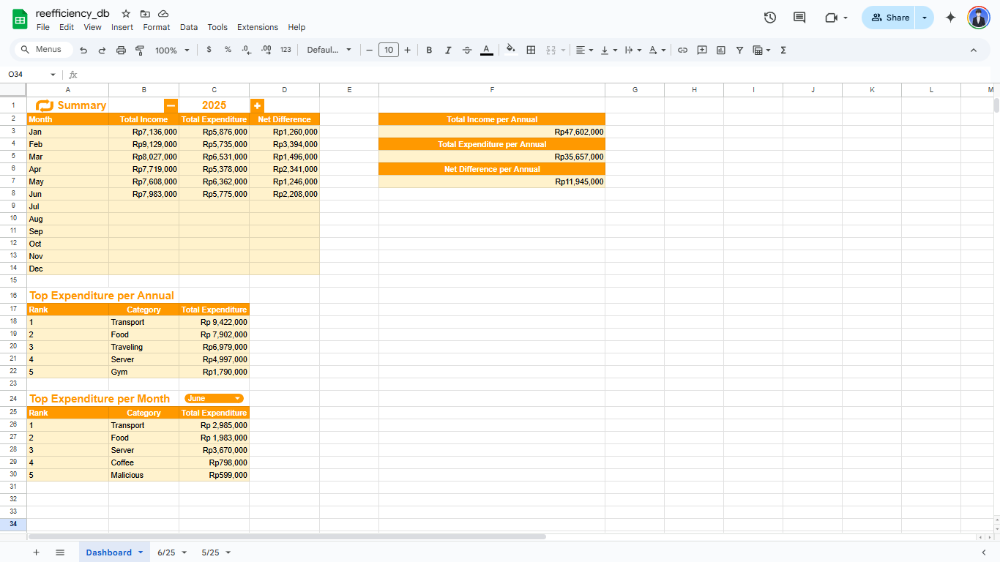

# Google Sheets Setup for Financial Telegram Bot

This document outlines the steps to set up Google Sheets for full integration with the Telegram bot and internal dashboard automation scripts.

## 1. Prerequisites

-   You have a `credentials.json` file for Google service account
-   You have created a Google Cloud project with Google Sheets API enabled
-   Python environment with required dependencies installed
-   Telegram bot token from BotFather

## 2. Initial Google Sheet Creation & Configuration

1. **Create New Google Sheet**:

    - Open [Google Sheets](https://docs.google.com/spreadsheets) and create a new spreadsheet
    - Name it appropriately (e.g., `Financial Report Bot`). This name must match the `GOOGLE_SHEET_NAME` environment variable in your bot configuration

2. **Share with Service Account**:
    - Open your `credentials.json` file and find the service account email (e.g., `bot-name@your-project.iam.gserviceaccount.com`)
    - Click the **"Share"** button in the top-right corner of Google Sheet
    - Enter the service account email address and grant **"Editor"** access. This is mandatory for the Python bot to read and write data to the sheet

## 3. Dashboard Sheet Setup

This is the main control center and summary sheet for financial data visualization.

<div style="display: flex; gap: 10px;  align-items: center;justify-content: center;">

</div>

1. **Create Dashboard Sheet**:

    - Create a new sheet (tab) and rename it to `Dashboard`. This name is required as both Python and Google Apps Script reference this exact name

2. **Setup Layout Structure**:
   Configure the following cells exactly as specified. The scripts use these cell positions for reading and writing data:

    **Main Headers & Controls:**

    - `A1`: `Financial Dashboard Summary` (Title)
    - `C1`: Current year (e.g., `2025`). This cell controls which year's data is displayed

    **Monthly Summary Table:**

    - `A2:D2`: Headers: `Month`, `Total Income`, `Total Expenditure`, `Net Difference`
    - `A3:A14`: Month names (`Jan`, `Feb`, `Mar`, etc.)

    **Annual Summary:**

    - `F2`: `Total Annual Income`
    - `F4`: `Total Annual Expenditure`
    - `F6`: `Net Annual Difference`

    **Top Annual Expenditures:**

    - `A16`: `Top 5 Annual Expenditures`
    - `A17:C17`: Headers: `Rank`, `Category`, `Total Expenditure`
    - `A18:A22`: Rank numbers (`1`, `2`, `3`, `4`, `5`)

    **Top Monthly Expenditures:**

    - `A24`: `Top 5 Monthly Expenditures (Select Month Below)`
    - `A25:C25`: Headers: `Rank`, `Category`, `Total Expenditure`
    - `A26:A30`: Rank numbers (`1`, `2`, `3`, `4`, `5`)

3. **Create Month Dropdown**:
    - Click on cell `C24`
    - Go to `Data` > `Data validation`
    - Click **"Add rule"**
    - Under _Criteria_, select **"Dropdown (from a range)"**
    - Enter month names in English: `January`, `February`, `March`, `April`, `May`, `June`, `July`, `August`, `September`, `October`, `November`, `December`
    - Click **"Done"**. This cell is used by the script to display top 5 monthly expenditures

## 4. Google Apps Script Setup

This script automates all calculations and updates in your `Dashboard` sheet.

1. **Open Script Editor**:

    - In your Google Sheet, go to `Extensions` > `Apps Script`
    - Delete all default code in the `Code.gs` file

2. **Copy and Paste Code**:

    - Copy the entire Google Apps Script code from [`google_sheet/src/scripts.gs`](src/scripts.gs)
    - Paste it into the Apps Script editor
    - Save the project by clicking the disk icon. Name the project (e.g., "Financial Dashboard Automation")

3. **First Run & Authorization**:
    - From the function dropdown above the editor, select `updateDashboard`
    - Click the **"Run"** button
    - An "Authorization required" dialog will appear. Click **"Review permissions"**, select your Google account, then click **"Allow"** to grant the script permission to manage your sheets

## 5. Creating Control Buttons (Optional but Recommended)

You can create buttons to easily increment/decrement the year in the dashboard.

<div style="display: flex; gap: 10px;  align-items: center;justify-content: center;">

</div>

1.  **Create Increment/Decrement Buttons**:

    -   In the `Dashboard` sheet, go to `Insert` > `Drawing`
    -   Use _Text box_ or _Shape_ to create two buttons with text "▲" (increment year) and "▼" (decrement year)

        for example:

        <div style="display: flex; gap: 10px;  align-items: center;justify-content: center;">
        
        
        </div>

    -   Position these buttons next to the year cell (`C1`)

2.  **Link Increment/Decrement Buttons to Functions**:

    -   Right-click the "▲" button, click the three-dot menu, and select **"Assign script"**
    -   In the dialog box, enter the function name: `incrementYear`
    -   Repeat for the "▼" button and link to function: `decrementYear`

3.  **Link Refresh Button** (Optional):

    -   In the `Dashboard` sheet create another button , go to `Insert` > `Drawing`
    -   Use _Text box_ or _Shape_ to create two buttons with text "🔄" (Refresh dashboard)

        for example:

        <div style="display: flex; gap: 10px;  align-items: top;justify-content: center;">
        

    -   Position these buttons next to the year cell (`A1`)
    -   Assign the script function `updateDashboard` to this button
    -   This allows you to manually refresh the dashboard data

## 6. Environment Configuration

Ensure your [`.env`](../.env.example) file contains the correct values:

```env
GOOGLE_SHEET_NAME=your_sheet_name
GOOGLE_SHEETS_CREDENTIALS_PATH=credentials.json
TELEGRAM_BOT_TOKEN=your_bot_token
ALLOWED_TELEGRAM_IDS=your_user_id
```

## 7. System Operation

**Transaction Recording (Python Bot)**: When you send a `/catat` command, the bot will:

1. Determine the monthly sheet name based on transaction date (format `M/YY`, e.g., `6/25`)
2. If the sheet doesn't exist, create it automatically with headers: `Tanggal`, `Kategori`, `Deskripsi`, `Pemasukan`, `Pengeluaran`

    _in english, it means [Date, Category, Description, Income, Expenditure]_

3. Add your transaction data to a new row in the appropriate sheet
4. Automatically trigger dashboard update via [`GoogleSheetsService.update_dashboard_data()`](../services/gsheets.py)

**Dashboard Automation (Google Apps Script)**: The dashboard updates automatically when:

1. You open the spreadsheet (`onOpen` trigger)
2. You change the year value in cell `C1` or month in cell `C24` (`onEdit` trigger)
3. You click the `🔄`
4. Any transaction is added through the Python bot (triggers automatic update)

**Auto-Update Triggers**: The Python bot includes multiple auto-update mechanisms:

-   After every transaction via [`add_transaction()`](../services/gsheets.py) in [`handlers/catat.py`](../handlers/catat.py)
-   On any unknown command or message via [`main.py`](../main.py)
-   Manual trigger through the `/catat` command regardless of content

## 8. Monthly Sheet Structure

Monthly sheets follow the `M/YY` naming convention and contain:

-   **Tanggal**: Transaction date (YYYY-MM-DD format)
-   **Kategori**: Transaction category
-   **Deskripsi**: Transaction description
-   **Pemasukan**: Income amount (for income transactions)
-   **Pengeluaran**: Expenditure amount (for expense transactions)

## 9. Dashboard Features

The automated dashboard provides:

-   **Monthly Summary**: Income, expenditure, and net difference for each month
-   **Annual Totals**: Aggregated yearly financial data
-   **Top 5 Annual Expenditures**: Highest spending categories for the selected year
-   **Top 5 Monthly Expenditures**: Highest spending categories for the selected month
-   **Year Control**: Dynamic year selection for data filtering
-   **Month Control**: Dropdown for monthly expenditure analysis

## 10. Authentication & Security

The system uses Google Service Account authentication:

-   Service account credentials are stored in [`credentials.json`](../credentials.json.example)
-   Telegram bot access is restricted to users listed in `ALLOWED_TELEGRAM_IDS`
-   Authentication is handled by [`AuthService`]../(services/auth.py)

## 11. Troubleshooting

**Common Issues:**

-   Ensure service account has Editor access to the spreadsheet
-   Verify all environment variables are correctly set in [`.env`](../.env.example)
-   Check that the Google Sheets API is enabled in your Google Cloud project
-   Confirm the spreadsheet name matches the `GOOGLE_SHEET_NAME` variable exactly

**Error Monitoring:**

-   Check Python bot logs for connection issues
-   Monitor Google Apps Script execution logs for automation errors
-   Verify cell references match the specified layout

Following these steps will ensure your Google Sheet is fully integrated and ready for use with the financial Telegram bot.
